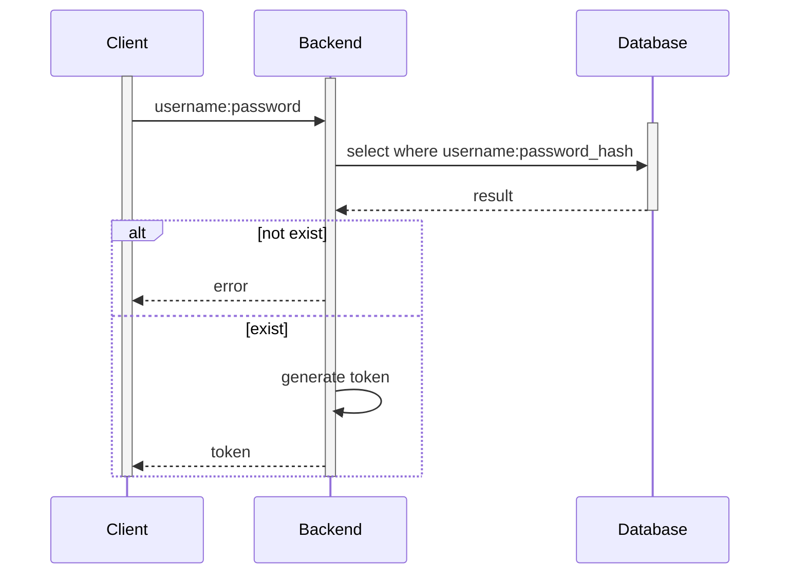
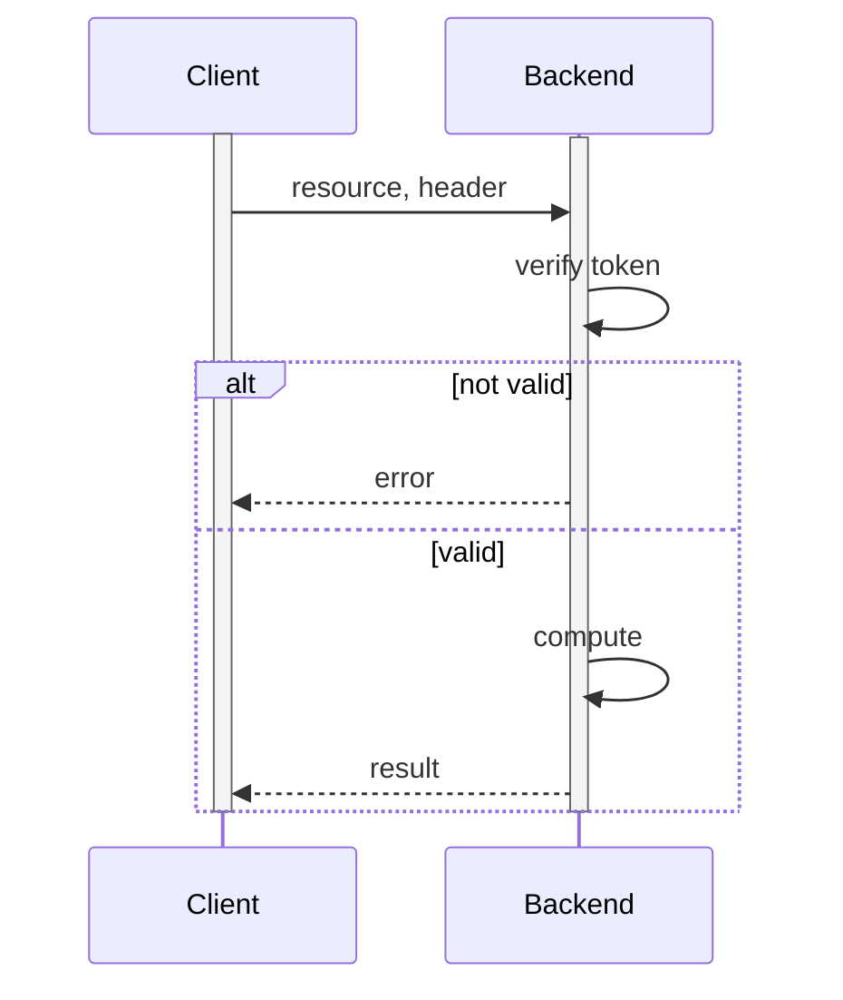

# Backend

Le backend du boilerplate contient : 
- Une authentification par token JWT
- Une route permettant de lister des ressources

## Prérequis
- composer

## Authentification

L'authentification est réalisée à l'aide d'une base de données et de token JWT

### Token JWT

Un token JWT est un payload JSON encodé en base64, il permets de stocker des informations tel que :
- La date d'émission du token
- L'émetteur du token
- La durée de validité du token
- Les informations utilisateur

### Fonctionnement

1. Le client (l'application appelant le backend) fait une demande de token en fournissant son identifant et son mot de passe
2. Si les informations d'authentification sont correct, le backend génère un token signé à l'aide d'une clé privée
3. Le client fournis ensuite le token à chacun des appels au backend
4. Le token est considéré valide si il peux être lu à l'aide de la clé public





Fichier `backend/login.php`

```php
<?php
    include('utils/auth.php');
    include('config.php');

    function get_client_from_username ($dbClient, $username) {
        $clean = mysqli_real_escape_string($dbClient, $username);
        $query = "SELECT id, password_hash FROM clients WHERE username = '$clean'";
        $result = mysqli_query($dbClient, $query);
        $row = mysqli_fetch_array($result, MYSQLI_ASSOC);

        if (mysqli_num_rows($result) > 0) {
            return $row;
        }

        return NULL;
    }

    if ($_SERVER["REQUEST_METHOD"] == "POST") {
        header('Content-Type: application/json');
        
        $content = file_get_contents("php://input");
        $decoded = json_decode($content, true);
        $client = get_client_from_username($db, $decoded['username']);
        
        if ($client != NULL) {
            if (password_verify($decoded['password'], $client['password_hash']))  {
                $token = build_token(file_get_contents(AUTH_PRIVKEY), array("username" => $decoded['username']), 3600);
                echo json_encode(array('token' => $token));
            }
            else {
                http_response_code(401);
                echo json_encode(array('error' => 'Invalid username or password'));
            }
        }
        else {
            http_response_code(401);
            echo json_encode(array('error' => 'Invalid username or password'));
        }
    }
?>
```


### Resources protégées

Le client doit fournir un token valide pour accéder au ressources

Fichier `backend/resources.php`
```php
<?php
    include('utils/auth.php');
    include('config.php');
    require_auth();

    echo json_encode(
        array("items" => array(
            array(
                "id" => 1,
                "title" => "First resources",
                "description" => "Lorem ipsum dolor sit amet, consectetur adipiscing elit. Maecenas ut lorem sit amet ex posuere varius. Nam metus velit, sagittis placerat quam ac, sagittis tincidunt enim. Curabitur rutrum egestas lorem, non mollis libero lacinia eget. Integer felis arcu, pharetra sed bibendum et, dictum ut orci."
            ),
            array(
                "id" => 2,
                "title" => "Second resources",
                "description" => "Aliquam nisl orci, placerat non massa ac, sollicitudin semper justo. Vivamus lacinia eu dui eget mollis. Duis ornare feugiat orci, sit amet commodo urna."
            ),
            array(
                "id" => 3,
                "title" => "Third resources",
                "description" => "Nunc a elementum justo. Etiam sapien justo, feugiat nec est et, sagittis pulvinar velit. Pellentesque rhoncus, nunc et rhoncus commodo, justo odio vestibulum metus, eget pulvinar nibh metus vitae massa."
            )
        ))
    );
?>
```

